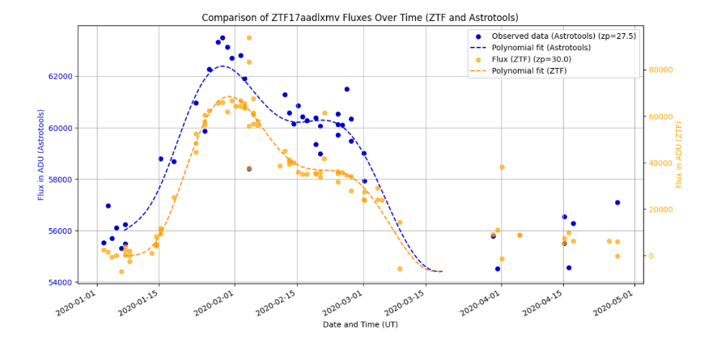

# 🔭 ZTF-Tools

**Open-source Python framework for large-scale ZTF public data processing and Type Ia supernova detection**

[](https://python.org)
[](https://www.astropy.org)
[](https://github.com/Electronovae/ztf-snia-public-scraper/blob/main/LICENSE)
<!-- Badge CI a ajouter ici une fois le workflow en place (bloc 1.3) -->

---

## 🌌 What is ZTF-Tools?

ZTF-Tools is a modular, reproducible Python pipeline built to **download, process and analyze public science images from the [Zwicky Transient Facility (ZTF)](https://www.ztf.caltech.edu/)**, with the goal of detecting faint Type Ia supernovae missed by the standard real-time alert system.

The project was developed as part of a Master's thesis in Fundamental Physics & Astrophysics at [EUPI — Université Clermont Auvergne](https://eupi.uca.fr), and is released as open-source to support community-driven transient discovery.

### Results

**Measured**

| Metric | Value |
|---|---|
| Public ZTF archive indexed | 544.000 HTML files |
| Processing speed-up (parallelization) | ×4 via ThreadPoolExecutor |
| Light curve validated against | ZTF-COSMO-DR2 catalog, on confirmed SN ZTF17aadlxmv |

**Estimated analytically** (not measured on real detections)

| Metric | Value |
|---|---|
| Theoretical SNe Ia detection gain (stacking ×1.5) | +20% under ideal conditions |

---

## 🛰️ Pipeline Overview

```
ZTF Public Archive (IRSA)
         │
         ▼
┌─────────────────────┐
│  1. Archive Indexer  │  ← Parse archive index files → local CSV index
│   (CSVDownloader)    │    Download from hours to < 1 hour
└────────┬────────────┘
         │
         ▼
┌─────────────────────┐
│  2. Image Download   │  ← Select by field / filter / CCD / quadrant / date
│   (ZTFDownloader)    │    Parallelized across 16 quadrants
└────────┬────────────┘
         │
         ▼
┌─────────────────────┐
│  3. Preprocessing    │  ← Zero-point photometric normalization
│   (AstroTools)       │    Saturation masking · Sky background removal
└────────┬────────────┘
         │
         ▼
┌─────────────────────┐
│  4. Alignment        │  ← WCS astrometric reprojection (reproject_interp)
│   (AstroTools)       │    All images registered to common reference frame
└────────┬────────────┘
         │
         ▼
┌─────────────────────┐
│  5. Reference Image  │  ← Pixel-wise median stack (memory-efficient, line-by-line)
│   (AstroTools)       │    PSF equalization via Gaussian degradation
└────────┬────────────┘
         │
         ▼
┌─────────────────────┐
│  6. Temporal Stack   │  ← Groups of 3 images → SNR gain √3 (~+0.6 mag)
│   (AstroTools)       │    Reveals transients below single-exposure threshold
└────────┬────────────┘
         │
         ▼
┌─────────────────────┐
│  7. Image Subtraction│  ← Science − Reference → residual map
│   (AstroTools)       │    Transient detection via DAOStarFinder
└────────┬────────────┘
         │
         ▼
┌─────────────────────┐
│  8. Photometry &     │  ← Aperture photometry on transient positions
│     Light Curves     │    Spatial clustering · ZTF catalog comparison
│   (AstroTools)       │
└─────────────────────┘
```

---

## ✨ Example: SN ZTF17aadlxmv

The pipeline was validated on a confirmed Type Ia supernova from the ZTF-COSMO-DR2 catalog.



The reconstructed light curve (ZTF-r filter) correctly reproduces:

- **Primary maximum** ~ January 30, 2020
- **Secondary shoulder** ~ mid-February 2020 (characteristic of SNe Ia in red bands)
- Smooth decline into plateau phase


The temporal structure aligns well with the official ZTF catalog flux measurements, confirming the pipeline's photometric reliability.

---

## 🚀 Quick Start

### Installation

```bash
git clone https://github.com/Electronovae/ztf-snia-public-scraper.git
cd ztf-snia-public-scraper
pip install -r requirements.txt
```

### 1. Generate the archive index (run once)

```
# See notebooks/00_build_index.ipynb
# Downloads and parses IRSA index files → fichiers_par_field.csv
# Warning: requires significant disk space and several hours on first run
```

### 2. Download images for a target field

```python
from astrotools import ZTFDownloader

downloader = ZTFDownloader(data_type="sciimg", output_base_dir="ztf_data")
downloader.download_from_csv(
    csv_path="fichiers_par_field.csv",
    target_field="0664",
    filter_band="zr",
    ccd="06",
    quadrant="1",
    start_date="20200101",
    end_date="20200501"
)
```

### 3. Run the full pipeline

```python
import glob
from astrotools import AstroTools

# Load FITS files
fits_files = sorted(glob.glob("ztf_data/000664_zr_c06_o_q1/*.fits"))
tool = AstroTools(fits_files, file_name="000664_zr_c06_o_q1")

# Seeing statistics
tool.distrib_seeing()

# Align all images
tool.align_images()

# Build reference image
aligned = sorted(glob.glob("ztf_data_aligned/000664_zr_c06_o_q1/*.fits"))
tool.get_refimg(aligned, ref_method="median", seeing_max=6, zp_ref=27.5)

# Image subtraction + transient detection
stack_files = sorted(glob.glob("ztf_data_stack/000664_zr_c06_o_q1/*.fits"))
ref = "ztf_data_ref/000664_zr_c06_o_q1/refimg_median_000664_zr_c06_o_q1.fits"
results = tool.subtraction(stack_files, ref, ra=246.52, dec=26.84,
                           Start_Year=2020, Start_Month=1, Start_Day=1,
                           End_Year=2020, End_Month=5, End_Day=1)
```

Un script equivalent, teste de bout en bout, doit exister dans `examples/quick_start.py` (bloc 1.1). S'il n'existe pas encore, retire cette phrase.

---

## 📁 Repository Structure

```
ztf-snia-public-scraper/
├── astrotools/
│   ├── __init__.py
│   ├── pipeline.py          # AstroTools class — full processing pipeline
│   ├── downloader.py        # ZTFDownloader class — archive access
│   └── photometry.py        # Aperture photometry utilities
├── notebooks/
│   ├── 00_build_index.ipynb       # Archive indexing (run once)
│   ├── 01_starter_pack.ipynb      # Full pipeline walkthrough
│   └── 02_ZTF17aadlxmv.ipynb      # Case study: confirmed SNe Ia
├── examples/
│   └── quick_start.py
├── tests/
│   └── ...                        # cf. bloc 1.3
├── docs/
│   ├── light_curve_ztf17aadlxmv.png
│   ├── difference_image_transient.png
│   ├── DEVENDER--DAUGE-Florian-Presentation-M2.pdf
│   └── M2-TER-REPORT-DEVENDER--DAUGE-FLORIAN-1.pdf
├── pyproject.toml
├── requirements.txt
├── LICENSE
└── README.md
```

*Cette arborescence doit rester le reflet exact du dépôt reel. Si un dossier annonce ci-dessus n'existe pas encore, retire-le de la liste plutot que de laisser une promesse non tenue.*

---

## 📦 Requirements

```
astropy>=5.0
numpy>=1.24
matplotlib>=3.7
scipy>=1.10
reproject>=0.13
photutils>=1.9
tqdm>=4.65
pandas>=2.0
requests>=2.31
```

Install all dependencies:

```bash
pip install -r requirements.txt
```

> ⚠️ **Disk space**: processing a full ZTF quadrant over several years can require tens of GB per quadrant depending on the time window selected.

---

## 🔬 Technical Details

### Memory-efficient median stacking

Rather than loading all images into RAM simultaneously, the reference image is computed **line by line** from memory-mapped NumPy arrays:

```python
for i in range(H):
    rows = [np.load(p, mmap_mode='r')[i, :] for p in valid_paths]
    stack = np.vstack(rows)
    image_median[i, :] = np.median(stack, axis=0)
```

This allows processing hundreds of images on a standard workstation.

### Parallelized download

All 16 CCD quadrants can be downloaded simultaneously:

```python
from concurrent.futures import ThreadPoolExecutor, as_completed

args_list = [(ccd, quad) for ccd in range(1, 5) for quad in range(1, 5)]
with ThreadPoolExecutor(max_workers=16) as executor:
    futures = [executor.submit(download_quadrant, args) for args in args_list]
```

### PSF equalization

Before stacking, images are convolved with a Gaussian kernel to homogenize the PSF across different seeing conditions:

```python
fwhm_diff = np.sqrt(seeing_to**2 - seeing_from**2)
sigma_pix = fwhm_diff / (2.3548 * pixel_scale)
image_degraded = gaussian_filter(image, sigma=sigma_pix)
```

> Cas limite corrige au bloc 1.3 : si `seeing_to < seeing_from`, l'expression sous la racine est negative et produit un NaN silencieux. La fonction doit lever une exception explicite dans ce cas.

### Automatic transient detection

Transients in difference images are identified using `DAOStarFinder` with sigma-clipped statistics, then spatially clustered across epochs to reject artifacts:

```python
mean, median, std = sigma_clipped_stats(diff_img, sigma=3.0)
daofind = DAOStarFinder(fwhm=seeing_ref, threshold=5.0 * std)
sources = daofind(diff_img - median)
```

---

## 📊 Detection Rate Estimation (analytical, not measured)

Under ideal conditions, stacking N=3 images improves the limiting magnitude by:

$$\Delta m = 1.25 \log_{10}(N) \approx +0.6 \text{ mag}$$

Given a power-law source count distribution (α ≈ 0.6), the expected detection gain is:

$$N_{\text{stacked}} = N_{\text{initial}} \times N^{0.75} \approx 2.82 \times N_{\text{initial}}$$

Applied to ZTF field 0664 (357 nights, 11.75 deg²): expected gain from <1 to ~1.5 SNe Ia per field.

This is a theoretical estimate under idealized conditions, not a measured detection count on real data.

---

## 🔓 Open Science Philosophy

This framework is built entirely on **publicly available ZTF data** (hosted on [IRSA](https://irsa.ipac.caltech.edu/)) and released under MIT license.

Goals:

- Democratize access to time-domain astrophysics
- Enable community-driven transient searches in archival data
- Provide a reproducible, extensible foundation for future surveys (LSST/Rubin Observatory)

---

## 📖 Scientific Context

This work is motivated by the **Hubble tension** — a >5σ discrepancy between early-universe (Planck CMB, H₀ ≈ 67.4 km/s/Mpc) and late-universe (SH0ES distance ladder, H₀ ≈ 73.0 km/s/Mpc) measurements of the expansion rate. Detecting more Type Ia supernovae in archival data contributes to improving the statistical sample used to constrain H₀.

**Reference catalog**: [ZTF-COSMO-DR2 (Rigault et al. 2025)](https://github.com/ZwickyTransientFacility/ztfcosmo) — 3268 SNe Ia over 2018–2021.

---

## 👤 Author

**Florian Devender-Dauge**
Master Physique Fondamentale & Applications — EUPI, Université Clermont Auvergne
Supervised by Philippe Rosnet & Marie Aubert (LPC Clermont)

[](https://www.linkedin.com/in/florian-devender-dauge-bab4261a9/)
[](https://github.com/Electronovae)

---

## 🙏 Acknowledgements

- Philippe Rosnet & Marie Aubert (LPC Clermont) — supervision
- Quentin Arvois — image alignment & reference pipeline (co-developer)
- The ZTF collaboration & IRSA team — public data access
- The Astropy & photutils communities

---

## 📄 License

MIT License — see [LICENSE](https://github.com/Electronovae/ztf-snia-public-scraper/blob/main/LICENSE) for details.
